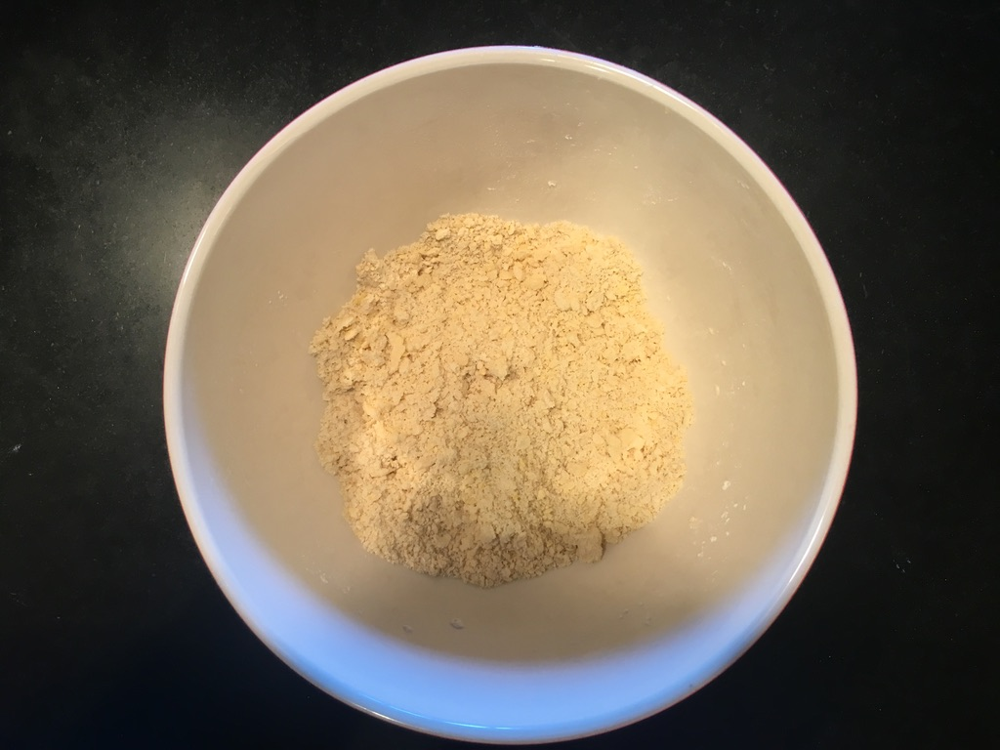

Classic delicous dessert that will undoubtely delight your guests. The apple selection is essential to the success of this recipe. Select juicy apples such as Golden Delicious or pink ladies. This recipe uses a light version of the pate brisee without sugar. The dough has to bake for a long time and doughs containing sugar tend to burn before the apples are fully baked. 

# Ingredients

## Dough
- 200g of flour
- a generous pinch of salt
- 100g of unsalted butter cut in dice and at room temperature
- 1 egg yoke
- 2-3 table spoons of very code water

## Garnish
- 4-5 juicy apples peeled and without seeds
- 3 table spoon of caster sugar
- 50g of unsalted butter cut in dice
- 4-6 teaspoons of abricot jam
- 2 teaspoons of Calvados (French liquor made with apples)

## The dough

Classic method            | steps
--------------------------|-----
 | sift the flour and the salt through a strainer 
 | make a hole in the middle with your fist
 | Put the butter and the yoke wt mix with the tip of your finger until the mixture looks like scramble eggs
 | Using a spatula fall in the flour into the mix of butter and egg chopping the mixture to properly incorporate the flour
 | Sprinkle the iced water and mix again choping the dough with the spatula
 | Using a spatula fall in the flour into the mix of butter and egg chopping the mixture to properly incorporate the flour
 | Gather the dough and knead it to form a round ball, then flatten it slightly
 | Wrap it in a plastic film and put it in the fridge for at least 30mn. Take it out and wait for it to reach room temperature

## The garnish
